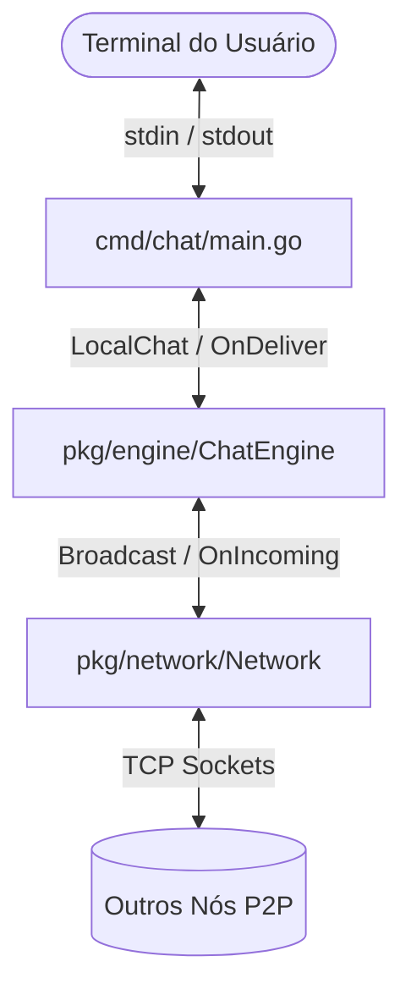
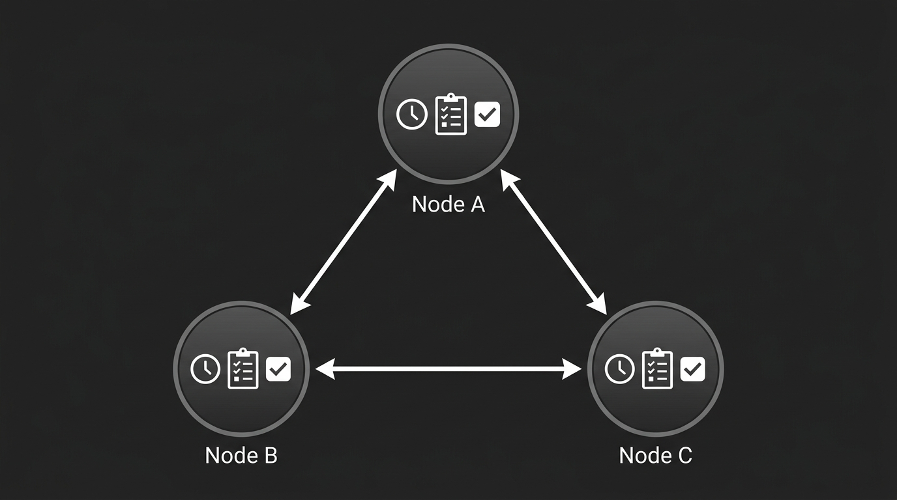
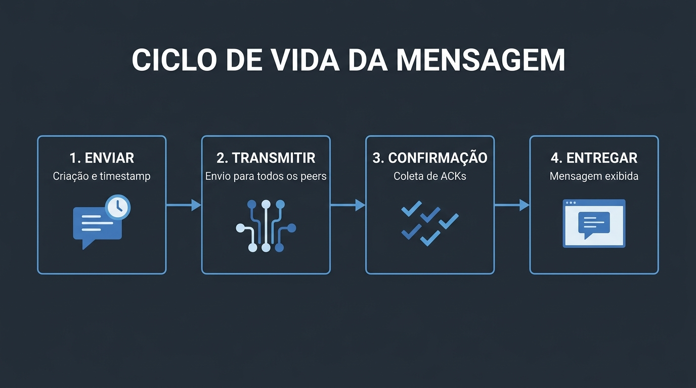

# Kairos Chat - Chat P2P Descentralizado com Ordenação Total

Este projeto consiste em uma aplicação de chat P2P (Peer-to-Peer) totalmente descentralizada desenvolvida em Go. A solução implementa o clássico algoritmo de **Ordenação Total (Total Ordering)** proposto por Leslie Lamport no artigo de 1978 (*"Time, Clocks, and the Ordering of Events in a Distributed System"*), fazendo uso de **Relógios Lógicos de Lamport** e de um protocolo de **Consenso Baseado em Confirmações Globais (ACKs)**.

O projeto foi construído como parte prática de avaliação para a disciplina **TEC507 - Sistemas Distribuídos Avançados**.

---

## 1. Fundamentação Teórica e Objetivos

### 1.1. O Problema da Sincronização em Sistemas Distribuídos
Em sistemas centralizados, a ordenação de eventos é trivial: o servidor central atua como autoridade temporal única. No entanto, em sistemas distribuídos e descentralizados (P2P), três desafios principais impedem essa abordagem simples:
1. **Ausência de Relógio Físico Global Comum**: Devido a natureza imperfeita dos relógios de hardware, não existe um tempo universalmente confiável que possa ser usado para ordenar eventos em diferentes nós. Até mesmo sincronizações de tempo como NTP (Network Time Protocol) possuem margens de erro são inaceitáveis para determinar a precedência de eventos muito próximos no tempo.
3. **Latência de Rede Variável**: Mensagens enviadas no instante $t_1$ podem chegar a diferentes destinos em ordens distintas devido a congestionamentos de rotas, retransmissões e latências variáveis.
4. **Concorrência Verdadeira**: Eventos que ocorrem simultaneamente em nós geograficamente distantes não possuem uma relação causal física direta evidente.

### 1.2. A Relação de Precedência Causal (Happens-Before)
Leslie Lamport definiu a relação de precedência causal, denotada por $\to$ (happens-before), como uma ordem parcial de eventos em um sistema:
- Se os eventos $a$ e $b$ pertencem ao mesmo processo e $a$ ocorre antes de $b$, então $a \to b$.
- Se o evento $a$ é o envio de uma mensagem por um processo e o evento $b$ é o recebimento dessa mesma mensagem por outro processo, então $a \to b$.
- Se $a \to b$ e $b \to c$ (transitividade), então $a \to c$.

Se dois eventos distintos $x$ e $y$ não possuem relação causal ($x \not\to y$ e $y \not\to x$), diz-se que eles são **concorrentes** ($x \parallel y$).

### 1.3. Relógios Lógicos de Lamport
Um relógio lógico de Lamport é um contador de software associado a cada processo $P_i$. O relógio $C_i$ atribui um timestamp $C_i(a)$ a cada evento $a$ em $P_i$. A propriedade fundamental do relógio lógico é a **Condição do Relógio**:
$$\text{Para quaisquer eventos } a, b: \text{se } a \to b, \text{ então } C(a) < C(b)$$

Para garantir a Ordenação Total (representada por $\Rightarrow$), Lamport introduziu um critério de desempate determinístico (como o ID alfabético dos processos). Assim, a ordem total é definida por:
$$a \Rightarrow b \iff (C(a) < C(b)) \lor (C(a) = C(b) \land ID(a) < ID(b))$$

### 1.4. Por que precisamos de ACKs?
O simples uso de relógios de Lamport e a associação de timestamps às mensagens não é suficiente para garantir a entrega imediata da mensagem no chat. Uma mensagem com timestamp $T_1$ pode sofrer um grande atraso na rede e chegar ao destinatário após este já ter exibido uma mensagem com timestamp $T_2$ ($T_2 > T_1$). Isso causaria uma violação de ordenação retroativa (exibição fora de ordem).

Para evitar isso, uma mensagem com timestamp $T$ só pode ser exibida quando o nó tiver a garantia de que **nenhuma outra mensagem com timestamp menor ou igual a $T$ poderá chegar no futuro**. O protocolo garante isso exigindo que:
1. Toda mensagem recebida seja respondida com uma mensagem de confirmação (`ACK`) enviada a todos os nós.
2. Os canais de comunicação sejam **FIFO** (garantido pelo protocolo TCP).
3. A mensagem só seja entregue se estiver no topo da fila local e tiver recebido confirmação (`ACK`) de todos os participantes do sistema.

### 1.5. Limitações e Desvantagens do Uso de ACKs

Embora garanta a ordenação total consistente, o protocolo baseado em confirmações unânimes ainda apresenta algumas desvantagens críticas para sistemas distribuídos:

- **Alta Sobrecarga de Rede e Complexidade da Rede**: Para cada mensagem enviada no chat em uma rede com $N$ nós, o nó emissor precisa realizar um broadcast para todos os outros $N-1$ nós. Em seguida, cada um destes nós precisa responder com um pacote `ACK` enviado para **todos** os demais participantes. O número total de mensagens de controle trafegadas por mensagem útil de chat é de $(N-1) + (N-1)^2 = N(N-1)$ mensagens. Essa complexidade quadrática inviabiliza o escalonamento do sistema para centenas ou milhares de participantes.
- **Latência Limitada pelo Nó Mais Lento**: Uma mensagem no topo da fila de espera local só é entregue quando todas as confirmações chegarem. Como consequência, a velocidade com que as mensagens aparecem na tela é limitada pela latência de rede e processamento do nó mais lento da malha.
- **Vulnerabilidade a Falhas**: O protocolo pressupõe que todos os nós estejam ativos e conectados. Se um único nó falhar ou perder a conexão, ele não enviará mais confirmações, e a entrega de mensagens subsequentes será bloqueada indefinidamente. Isso cria um ponto único de falha que pode paralisar toda a aplicação.

---

## 2. Arquitetura do Sistema

O sistema foi estruturado seguindo o princípio de separação de responsabilidades, dividindo-se em três camadas principais:

```text
+-------------------------------------------------------------+
|                CAMADA DE APLICAÇÃO (cmd/chat)               |
|   - Leitura de CLI Flags (-id, -addr, -peers)               |
|   - Loop de Entrada do Usuário (stdin -> bufio.Scanner)     |
|   - Impressão na Tela (OnDeliver Callback)                  |
+-------------------------------------------------------------+
                              | |  (Chamadas locais e callbacks)
                              v v
+-------------------------------------------------------------+
|            CAMADA DE CONSENSO LÓGICO (pkg/engine)           |
|   - Relógio Lógico de Lamport (e.g., localClock)            |
|   - Fila de Prioridades (waitQueue - Ordenada)              |
|   - Tabela de Confirmações Globais (ackTable)               |
+-------------------------------------------------------------+
                              | |  (Broadcasts e Tráfego de Entrada)
                              v v
+-------------------------------------------------------------+
|              CAMADA DE REDE TCP P2P (pkg/network)           |
|   - Ouvinte TCP & Thread de Aceite de Conexões              |
|   - Malha de Conexão (Evita corridas P2P)                   |
|   - Protocolo JSON                                          |
+-------------------------------------------------------------+
```

### 2.1. Arquitetura de Sockets e Topologia da Rede
Diferente de sistemas cliente-servidor tradicionais, a rede do **Kairos Chat** funciona em uma topologia de malha totalmente conectada (*Fully Connected Mesh*). Desse modo, cada nó mantém uma conexão TCP persistente com todos os outros nós da rede.

#### Resolução de Conflito de Conexões Duplicadas
Quando o sistema inicia, os nós tentam se conectar simultaneamente. Para evitar que dois nós criem dois sockets TCP independentes entre si (o que causaria uma duplicidade de fluxo), a camada de rede emprega a regra de ordenação de strings por ordem alfabética:
- Se `LocalNodeID < PeerNodeID`, o nó local assume o papel de iniciador da conexão, realizando a comunicação ativa com o endereço do outro nó.
- Se `LocalNodeID > PeerNodeID`, o nó local assume o papel de receptor, aguardando que o outro nó inicie a conexão.

Essa estratégia puramente distribuída assegura que cada par de nós compartilhe exatamente um socket de comunicação bidirecional único.



### 2.2. Diagrama de Arquitetura Esquematizado
O diagrama abaixo ilustra a topologia de malha totalmente conectada entre três nós (`Node A`, `Node B` e `Node C`), evidenciando os três componentes locais fundamentais em cada nó (Relógio de Lamport, Fila de Prioridades e Tabela de Confirmações):



---

## 3. Funcionamento Detalhado do Algoritmo de Consenso

A lógica principal do sistema é implementada no pacote `pkg/engine`, que gerencia o ciclo de vida das mensagens e a entrega ordenada em todos os nós da rede.

### 3.1. Primitivas de Mensagem (O Pacote JSON)
Todas as interações na rede utilizam a estrutura `Packet` definida em `pkg/engine/packet.go`:
- `Type`: `"CHAT"` para novas mensagens, ou `"ACK"` para confirmações de recebimento.
- `NodeID`: Identificador do nó que criou o pacote (remetente).
- `LogicalTimestamp`: O valor do relógio lógico de Lamport associado ao evento.
- `MessageID`: UUID v4 gerado para identificar unicamente a mensagem.
- `ReferencedMessageID`: Usado em pacotes `ACK` para indicar qual mensagem está sendo confirmada. (Em pacotes `CHAT`, este campo é nulo.)
- `Text`: O conteúdo em texto plano da mensagem. (Em pacotes `ACK`, este campo é nulo.)

### 3.2. Passos Lógicos dos Eventos do Motor

#### 1. Envio de Mensagem Local (`LocalChat`)
Quando o usuário digita uma linha no terminal e pressiona *Enter*:
1. Bloqueia o Mutex da `Engine` para evitar condições de corrida.
2. Incrementa o relógio local: `e.localClock++`.
3. Cria um pacote do tipo `"CHAT"`, preenchendo o `LogicalTimestamp` com o novo valor de `e.localClock` e gerando um UUID exclusivo.
4. Insere o pacote na fila de prioridades local `waitQueue` através do método `insertToQueue(p)`. A inserção mantém a fila ordenada de forma determinística (menor timestamp primeiro; desempate pelo ID do nó).
5. Inicializa o controle de ACKs locais para essa mensagem: `e.ackTable[messageID][e.localNodeID] = true`.
6. Tenta executar a entrega local imediata via `checkDelivery()`.
7. Libera o Mutex e chama a camada de rede para realizar o `Broadcast` do pacote JSON para todos os peers conectados.

#### 2. Recebimento de Mensagem de Chat Remota (`HandleIncomingChat`)
Quando a camada de rede lê um pacote `"CHAT"` vindo do socket TCP:
1. Bloqueia o Mutex da `Engine`.
2. Atualiza o relógio de Lamport com base no timestamp da mensagem recebida:
   $$\text{e.localClock} = \max(\text{e.localClock}, \text{p.LogicalTimestamp}) + 1$$
3. Insere a mensagem na `waitQueue`.
4. Atualiza o `ackTable` da mensagem, registrando que tanto o remetente original quanto o próprio nó receptor já confirmaram o recebimento.
5. Monta um pacote `"ACK"` referenciando o ID da mensagem recebida, carimbado com o novo timestamp local incrementado.
6. Executa a checagem de entrega local `checkDelivery()`.
7. Desbloqueia o Mutex e transmite o pacote `"ACK"` via broadcast para a rede.

#### 3. Recebimento de Confirmação Remota (`HandleIncomingACK`)
Quando um pacote de confirmação (`"ACK"`) chega da rede:
1. Bloqueia o Mutex da `Engine`.
2. Atualiza o relógio local de Lamport:
   $$\text{e.localClock} = \max(\text{e.localClock}, \text{p.LogicalTimestamp}) + 1$$
3. Registra no mapa `ackTable` associado à mensagem referenciada que o nó emissor do ACK confirmou a mensagem: `e.ackTable[p.ReferencedMessageID][p.NodeID] = true`.
4. Executa `checkDelivery()` para verificar se o recebimento desse ACK destravou a entrega da mensagem correspondente ou de mensagens seguintes na fila.
5. Desbloqueia o Mutex.

#### 4. Avaliação de Liberação e Entrega (`checkDelivery`)
Esta função é executada de forma transacional (sob a proteção do Mutex) sempre que o estado interno da fila ou da tabela de ACKs é alterado:
1. O sistema entra em um loop enquanto a `waitQueue` contiver elementos.
2. Examina a mensagem no topo da fila (índice `0`). Por conta do ordenamento da fila de prioridade, esta é a mensagem com o menor timestamp global pendente.
3. Consulta a tabela de ACKs (`e.ackTable[messageID]`) para verificar se existe uma confirmação registrada de **todos** os nós do sistema.
4. Se a confirmação de algum nó estiver ausente, o algoritmo interrompe a verificação imediatamente. Isso é fundamental pois nenhuma mensagem seguinte na fila pode ser entregue antes da mensagem do topo, sob risco de violar a ordenação total.
5. Se todas as confirmações estiverem presentes:
   - Imprime a mensagem na tela do usuário via callback `OnDeliver`.
   - Remove a mensagem do topo da fila.
   - Remove o registro correspondente da `ackTable`.
   - Continua o loop para verificar se a próxima mensagem da fila também já possui todos os ACKs.

### 3.3. Ciclo de Vida da Mensagem e Consenso
O diagrama abaixo ilustra passo a passo a jornada de uma mensagem, desde a sua concepção em um nó remetente até a sua exibição/entrega ordenada em todos os nós da rede:



---

## 4. Análise do Código e Segurança de Concorrência em Go

A concorrência em Go exige extremo cuidado para evitar condições de corrida. O projeto lida com isso de forma eficiente através das seguintes técnicas de implementação:

### 4.1. Uso de Mutexes para Proteção de Estado Compartilhado
No arquivo [pkg/engine/engine.go](file:///home/jnaraujo/code/kairos-chat/pkg/engine/engine.go), todas as operações que modificam ou acessam as estruturas compartilhadas `localClock`, `waitQueue` e `ackTable` são protegidas por um mutex.

```go
type ChatEngine struct {
    mu          sync.Mutex
    localNodeID string
    peers       []string
    localClock  int
    waitQueue   []Packet
    ackTable    map[string]map[string]bool
    // ...
}
```

Desso modo, qualquer função que precise ler ou escrever nesses campos deve adquirir o lock antes de operar e liberá-lo imediatamente após a operação crítica.

#### Evitando Deadlocks e Condições de Corrida

Um dos maiores problemas em redes concorrentes é manter o mutex bloqueado enquanto se realiza uma operação de I/O em rede (como enviar dados por um socket TCP). Se a rede estiver lenta ou congestionada, o fluxo ficará travado dentro do lock, impedindo que novas mensagens sejam processadas e causando um **deadlock**.

Como forma de evitar essa condição as operações locais de atualização de estado e as operações de transmissão de rede foram separadas. O lock é mantido apenas durante a atualização de estado local e liberado antes de qualquer operação de I/O de rede.

```go
func (e *ChatEngine) LocalChat(text string) {
    e.mu.Lock()
    // 1. Atualizações de estado local
    e.localClock++
    p := Packet{ ... }
    e.insertToQueue(p)
    e.ackTable[p.MessageID][e.localNodeID] = true
    e.checkDelivery()
    e.mu.Unlock() // <--- Lock liberado aqui!

    // 2. Broadcast de rede executado de forma assíncrona fora do escopo crítico
    if e.OnBroadcast != nil {
        e.OnBroadcast(p)
    }
}
```

### 4.2. Concorrência Confiável de Rede
A camada de rede em [pkg/network/network.go](file:///home/jnaraujo/code/kairos-chat/pkg/network/network.go) gerencia a leitura concorrente de cada conexão TCP em goroutines dedicadas.
- O método `acceptConnections` fica em uma goroutine infinita aceitando conexões.
- Cada conexão estabelecida executa `go n.readFromConn(...)`, que lê continuamente do socket TCP e envia os pacotes recebidos para o motor de consenso.
- Isso garante que novas mensagens recebidas de diferentes nós sejam processadas em paralelo, sem bloquear a recepção de outras mensagens.

---

## 5. Limitações Práticas e Trade-offs do Projeto

Como em qualquer sistema distribuído real, as escolhas de projeto envolvem trade-offs diretamente explicados pelo **Teorema CAP** (Consistência, Disponibilidade e Tolerância a Partições) e princípios de consistência forte:

### 5.1. Preservação de Consistência sobre Disponibilidade (CP)
O algoritmo de de ordenação total implementado prioriza a **Consistência** em detrimento da **Disponibilidade**.

Desse modo, o sistema garante que todos os nós vejam as mensagens na mesma ordem, mesmo que isso venha a bloquear a entrega de mensagens caso algum nó falhe ou fique isolado. Isso ocorre porque o critério de entrega de mensagens depende do recebimento de ACKs de **todos** os nós da rede. Se o nó `C` sumir, os nós `A` e `B` acumularão mensagens na `waitQueue` indefinidamente, sem nunca poder exibi-las na tela.

Como forma de solucionar esse problema, soluções industriais tolerantes a falhas utilizam algoritmos de consenso baseados em maioria simples (quórum), como **Raft** ou **Paxos**, em vez de exigir unanimidade global.

### 5.2. Canal de Comunicação Físico
O algoritmo assume canais de transmissão confiáveis e ordenados localmente (FIFO). A implementação resolve isso nativamente delegando a transmissão física ao protocolo **TCP**, que realiza internamente o sequenciamento, controle de fluxo e retransmissão de pacotes. Caso o transporte fosse feito em UDP, seria necessário implementar sequenciamento adicional na camada de aplicação para satisfazer as premissas do algoritmo de Lamport.

---

## 6. Estrutura de Diretórios do Projeto

Como forma de manter a separação de responsabilidades e facilitar a manutenção, o projeto foi organizado em uma estrutura de diretórios modular, utilizando princípio da Arquitetura Baseada em Domínios (Domain-Driven Design):

```text
kairos-chat/
├── cmd/
│   └── chat/
│       └── main.go       # Ponto de entrada (CLI), parse de flags e inicialização
├── pkg/
│   ├── engine/
│   │   ├── engine.go     # Motor lógico (Relógio de Lamport, waitQueue e ackTable)
│   │   ├── packet.go     # Esquema dos pacotes JSON de comunicação e utilitários
│   │   └── engine_test.go# Testes de unidade das regras lógicas do motor
│   ├── network/
│   │   ├── network.go    # Camada P2P (Sockets TCP, listener e tratamento concorrente)
│   │   ├── peers.go      # Utilitário de parsing de flags P2P
│   │   └── peers_test.go # Testes de unidade do parser de parâmetros
│   └── integration/
│       └── integration_test.go # Simulação de concorrência massiva na malha P2P
├── assets/
│   ├── architecture.jpg  # Diagrama esquematizado dos componentes e rede P2P
│   └── lifecycle.jpg     # Diagrama em 4 etapas do ciclo de vida da mensagem
├── Makefile              # Automação de compilação, limpeza e testes
└── go.mod                # Arquivo do módulo Go
```

Desse modo, a camada de aplicação (`cmd/chat`) não possui dependência direta com a camada de rede (`pkg/network`), e a camada de rede não possui dependência direta com a camada de motor lógico (`pkg/engine`). A comunicação entre as camadas é realizada através de **callbacks** e **interfaces**, garantindo baixo acoplamento e alta coesão.

---

## 7. Instruções de Execução e Compilação

### 7.1. Pré-requisitos
- Go SDK instalado (versão 1.18 ou superior).
- Utilitário `make` instalado (opcional, mas recomendado).

### 7.2. Compilação
Para gerar o binário otimizado da aplicação na raiz do projeto:
```bash
make build
```
Esse comando compila os pacotes e gera o executável nativo `chat`.

### 7.3. Exemplo de Execução Local em Malha
Abra três instâncias de terminais para simular a interação de três usuários (`userA`, `userB` e `userC`) rodando em sua máquina local:

**Terminal 1 (userA)**:
```bash
./chat -id userA -addr localhost:8080 -peers userB=localhost:8081,userC=localhost:8082
```

**Terminal 2 (userB)**:
```bash
./chat -id userB -addr localhost:8081 -peers userA=localhost:8080,userC=localhost:8082
```

**Terminal 3 (userC)**:
```bash
./chat -id userC -addr localhost:8082 -peers userA=localhost:8080,userB=localhost:8081
```

*Nota*: Os nós irão iniciar e aguardar até que a malha esteja 100% estabelecida e conectada. Uma vez estabelecido o consenso de rede, a mensagem "Mesh fully connected!" será exibida nos três terminais. A partir desse momento, qualquer mensagem digitada e enviada será ordenada globalmente e replicada de forma consistente em todas as telas.

---

## 8. Testes e Validação de Consenso Distribuído

O projeto conta com uma suíte abrangente de testes estruturada para garantir a validade teórica da ordenação total e a estabilidade da implementação sob estresse de rede.

### 8.1. Testes de Unidade (`pkg/engine`)
Os testes contidos em [pkg/engine/engine_test.go](file:///home/jnaraujo/code/kairos-chat/pkg/engine/engine_test.go) isolam a rede e validam as regras puras de concorrência temporal:
- Inserção ordenada na fila.
- Resolução correta de empates de timestamps usando a string do ID do nó.
- Atualização do relógio local conforme os axiomas de Lamport ($\max(Clock_{local}, Clock_{remoto}) + 1$).

### 8.2. Teste de Integração Distribuído (`pkg/integration`)
O teste [pkg/integration/integration_test.go](file:///home/jnaraujo/code/kairos-chat/pkg/integration/integration_test.go) simula uma execução real em malha TCP ativa:
1. Inicia três instâncias concorrentes completas (Network + Engine) em portas efêmeras.
2. Faz com que os nós estabeleçam conexões em loopback.
3. Dispara simultaneamente (usando goroutines concorrentes sob a primitiva `sync.WaitGroup`) múltiplas mensagens geradas ao mesmo tempo por nós diferentes para estressar as colisões temporais.
4. Aguarda a recepção completa dos ACKs.
5. Coleta e compara as mensagens exibidas nos logs de entrega final de cada nó. O teste falha caso a sequência exata de mensagens entregues mude entre qualquer um dos participantes, garantindo que o algoritmo de **Ordenação Total** foi verificado e validado com sucesso.

### 8.3. Executando os Testes Completos
Para executar toda a suíte de testes de maneira limpa (ignorando o cache do Go compilado) e com o detector de race conditions do Go ativado:
```bash
make test
```
